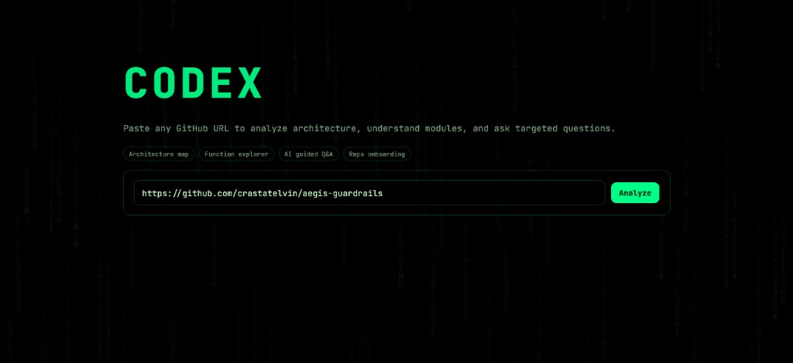
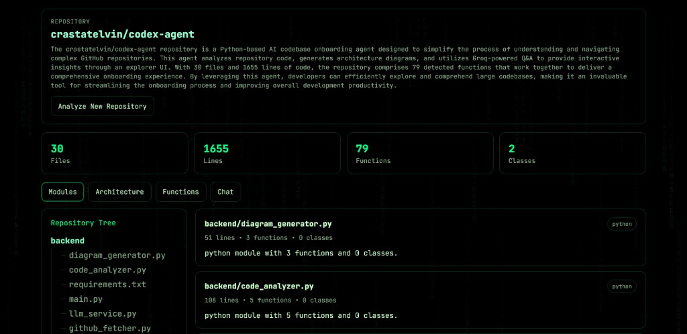
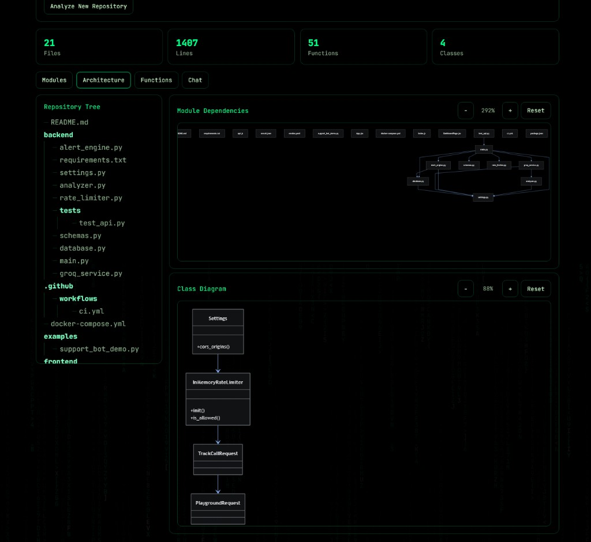
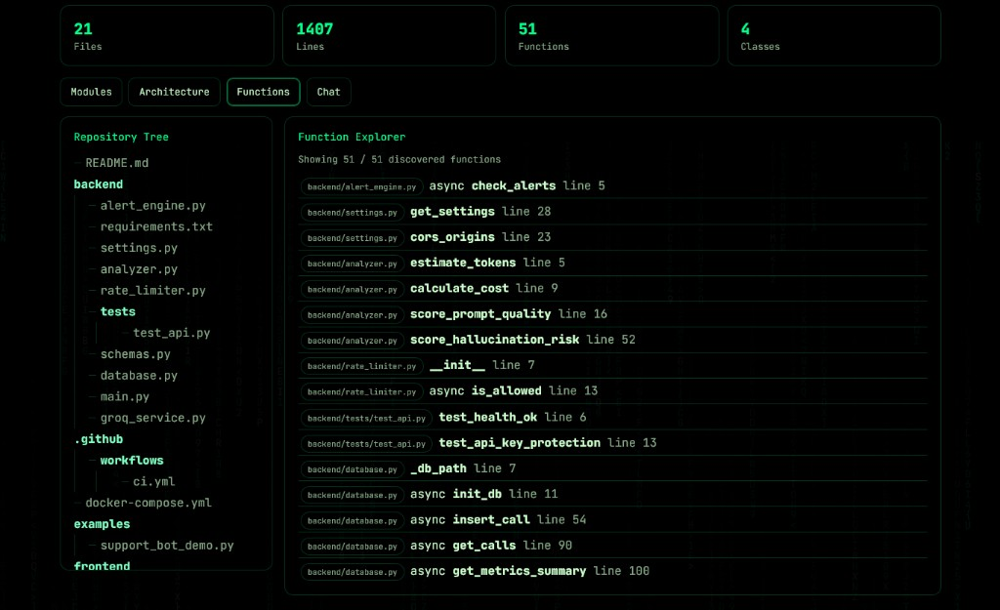
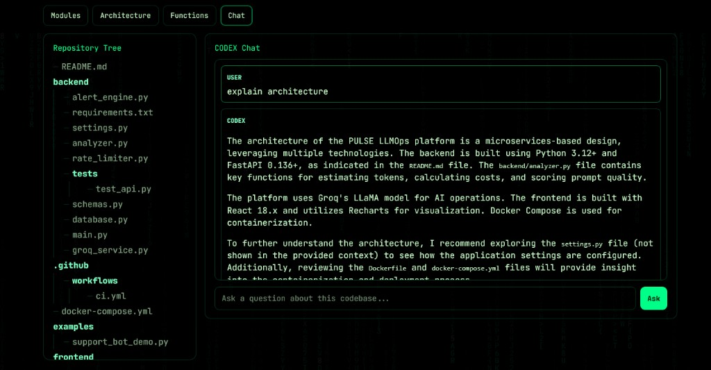

<div align="center">

# CODEX Agent

### AI Codebase Onboarding and Architecture Explorer

[](https://www.python.org/)
[](https://fastapi.tiangolo.com/)
[](https://react.dev/)
[](https://groq.com/)
[](https://mermaid.js.org/)
[](LICENSE)

<br/>

> **CODEX Agent** takes a public GitHub repository URL, reads and analyzes the codebase, generates architecture/class diagrams, and provides AI-assisted Q&A so developers can onboard faster and navigate unfamiliar systems confidently.

</div>

---

## Table of Contents

- [Overview](#overview)
- [Application Preview](#application-preview)
- [Features](#features)
- [Architecture](#architecture)
- [Tech Stack](#tech-stack)
- [Project Structure](#project-structure)
- [Installation](#installation)
- [Usage](#usage)
- [API Reference](#api-reference)
- [Configuration](#configuration)
- [Testing](#testing)
- [Deployment](#deployment)
- [Security Notes](#security-notes)

---

## Overview

CODEX is built for engineers who need to understand a repo quickly without manually reading every file in sequence.

It helps answer questions like:

- What does this repository do at a system level?
- Which files and functions matter most?
- How are modules connected?
- Where should a new feature be added?

Instead of static docs, CODEX generates a live, explorable view of the repository and pairs it with contextual AI responses.

---

## Application Preview

<br/>


<p><em>Landing screen with repository URL input and quick capability overview.</em></p>

<br/>


<p><em>Modules tab showing repository context, stats, file tree, and module cards in a single complete view.</em></p>

<br/>


<p><em>Architecture tab with module dependency and class diagrams, including zoom and drag controls.</em></p>

<br/>


<p><em>Function Explorer tab listing discovered functions across files with line-level references.</em></p>

<br/>


<p><em>Chat tab for repository-aware Q&A powered by Groq-based responses.</em></p>

---

## Features

| Feature | Description |
|---|---|
| URL-based analysis | Analyze any public GitHub repository by URL |
| Live analysis progress | Real-time processing updates via WebSocket |
| Module explorer | File/module cards with language and symbol summary |
| Architecture diagrams | Auto-generated Mermaid module dependency and class diagrams |
| Diagram controls | Zoom in/out, reset, wheel zoom, and drag-to-pan |
| Function explorer | Searchable cross-file function list with line references |
| Codebase Q&A | Ask questions and get repo-aware answers from Groq |
| Matrix-style UI | High-contrast developer-focused explorer theme |

---

## Architecture

```text
┌───────────────────────────────────────────────────────────────┐
│                         React Frontend                        │
│  Landing • Explorer tabs • File tree • Diagrams • AI Chat     │
└───────────────────┬───────────────────────────────────────────┘
                    │ HTTP + WebSocket
┌───────────────────▼───────────────────────────────────────────┐
│                         FastAPI Backend                       │
│                                                               │
│  POST /analyze   Parse repo, fetch files, analyze symbols     │
│  POST /ask       Query indexed chunks + generate answer       │
│  GET /status     Current loaded repo status                   │
│  GET /health     Health check                                 │
│  WS  /ws/{id}    Live analysis progress stream                │
└──────────────┬────────────────────────────────────────────────┘
               │
     ┌─────────▼──────────── ─┐          ┌───────────────────────┐
     │ GitHub REST API        │          │ Groq API              │
     │ repo tree + file fetch │          │ LLM explanations/Q&A  │
     └────────────────────────┘          └───────────────────────┘
```

---

## Tech Stack

| Layer | Technology |
|---|---|
| Frontend | React 18, Mermaid, Axios |
| Backend | FastAPI, Uvicorn, Pydantic, httpx |
| AI Provider | Groq Python SDK (`groq`) |
| Realtime | FastAPI WebSockets |
| Analysis | Python AST + JS/TS regex extraction |
| Search | In-memory indexed chunk matching |
| Testing | Pytest |
| Containers | Docker (frontend + backend) |

---

## Project Structure

```text
codex/
├── backend/
│   ├── main.py
│   ├── github_fetcher.py
│   ├── code_analyzer.py
│   ├── diagram_generator.py
│   ├── vector_store.py
│   ├── llm_service.py
│   ├── tests/
│   │   ├── conftest.py
│   │   └── test_core.py
│   ├── requirements.txt
│   ├── .env.example
│   └── Dockerfile
├── frontend/
│   ├── public/index.html
│   ├── src/
│   │   ├── components/
│   │   ├── hooks/
│   │   ├── pages/
│   │   ├── services/
│   │   └── styles/
│   ├── package.json
│   └── Dockerfile
├── DECISIONS.md
├── LICENSE
└── README.md
```

---

## Installation

### Prerequisites

- Python 3.12+
- Node.js 18+
- Groq API key
- GitHub token (recommended to avoid rate limits)

### Backend

```bash
cd backend
python -m venv venv
venv\Scripts\activate
pip install -r requirements.txt
copy .env.example .env
# add GROQ_API_KEY and GITHUB_TOKEN
uvicorn main:app --reload --host 0.0.0.0 --port 8000
```

### Frontend

```bash
cd frontend
npm install
npm start
```

### Local URLs

- App: `http://localhost:3000`
- API: `http://localhost:8000`
- API docs: `http://localhost:8000/docs`
- Health: `http://localhost:8000/health`

---

## Usage

1. Open `http://localhost:3000`
2. Paste a public GitHub repo URL
3. Click **Analyze**
4. Explore:
   - **Modules**
   - **Architecture**
   - **Functions**
   - **Chat**
5. Use diagram controls to zoom/pan large dependency/class graphs

---

## API Reference

| Method | Endpoint | Description |
|---|---|---|
| GET | `/` | Service info |
| GET | `/health` | Health status |
| GET | `/status` | Repository loaded state |
| POST | `/analyze` | Analyze GitHub repository |
| POST | `/ask` | Ask question about analyzed repository |
| WS | `/ws/{analysis_id}` | Real-time analysis progress |

---

## Configuration

Set values in `backend/.env`:

```env
GROQ_API_KEY=your_groq_api_key_here
GITHUB_TOKEN=your_github_token_here
MAX_FILES=200
MAX_FILE_SIZE_KB=100
```

Optional frontend env:

```env
REACT_APP_API_URL=http://localhost:8000
REACT_APP_WS_URL=ws://localhost:8000/ws
```

---

## Testing

```bash
# Backend tests
cd backend
venv\Scripts\python -m pytest -q

# Frontend production build
cd ../frontend
npm run build
```

---

## Deployment

- Backend image: `backend/Dockerfile`
- Frontend image: `frontend/Dockerfile`

You can deploy backend and frontend independently (e.g. Render + Vercel, or both via Docker).

---

## Security Notes

- Never commit real API keys or tokens.
- Rotate keys if exposed.
- Keep CORS restricted in production.
- Use managed secret storage for deployed environments.

---

## License

Licensed under **CC BY-NC 4.0** — see [LICENSE](LICENSE).

---

<div align="center">

Built with care by **Crasta Telvin** for developer onboarding workflows.

</div>
